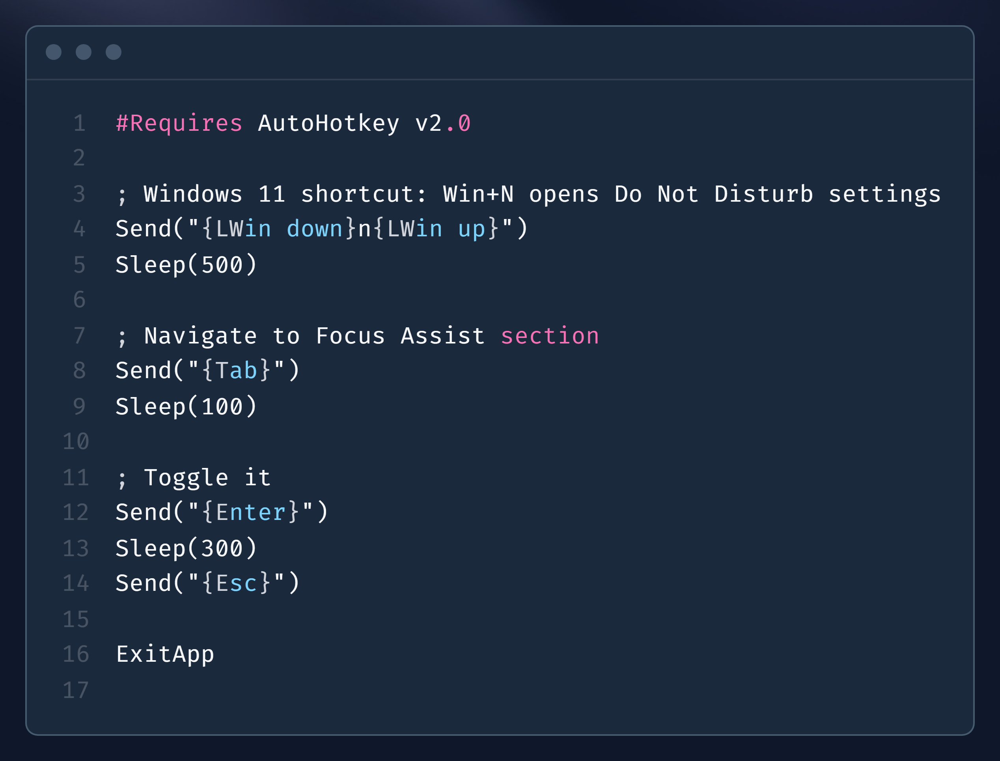

# Toggle Do Not Disturb

A Raycast extension to quickly toggle Windows 11's Do Not Disturb mode (Focus Assist).

## Features

- 🔇 Toggle Do Not Disturb on/off with a single command
- ⚡ Fast and lightweight
- 🎯 Works from anywhere in Windows via Raycast

## Installation

1. Install [Raycast](https://raycast.com) for Windows
2. Clone this repository or install from the Raycast Store (if published)
3. Run `npm install` to install dependencies
4. Run `npm run dev` to start the extension in development mode

## Usage

1. Open Raycast (Alt+Space by default)
2. Type "Toggle Notifications"
3. Press Enter to toggle Do Not Disturb on/off

## Requirements

- Windows 11
- Raycast for Windows (Beta)

## How it Works

This extension uses an AutoHotkey script to simulate keyboard inputs that toggle Windows 11's Do Not Disturb mode via Quick Settings.
- This is based on the default Windows 11 setup whereby WinKey + N brings up the Notification Center

## Note - .exe file included!
In order for the script to work without AutoHotkey, an Exe file is ran instead. 
This is purely the AHK file converted to an .EXE. However - **I highly recommend doing this yourself for security. You should never trust random .EXE files!**

**AHK Code:**


## Development

```bash
npm install
npm run dev      # Start development mode
npm run build    # Build the extension
npm run lint     # Run linter
npm run publish  # Publish to Raycast Store
```